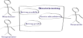

# Der Mensch im Zentrum
## Subjektorientiere Arbeitsabläufe leicht gemacht

### Arbeitsabläufe einfach und exakt mit native Sprachmitteln zeichnen.
OpenSBPM fügt das Subjekt als grammatikalisches Element in die Arbeitsablaufdefinition hinzu.

    

        <h3>Subjektorientierte Modellierung</h3>
        
    

    

        <h3>Prozesse vereinfachen</h3>
        
    

    

        <h3>Simulation</h3>
        
    

