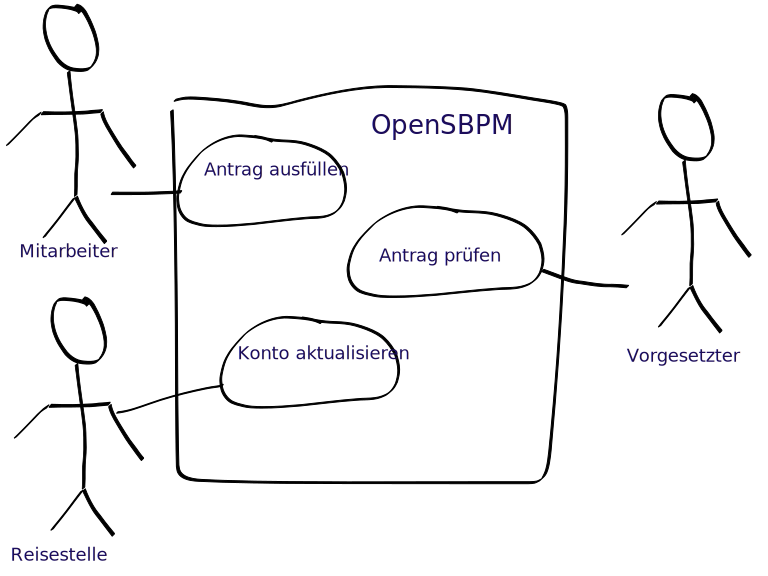

# Einfach intuitiv tun

# Arbeitsabläufe leichtgemacht
Subjektorientierte Arbeitsabläufe einfach erstellen und ausführen. OpenSBPM fügt das Subjekt als grammatikalisches 
Element in die Arbeitsablaufdefinition hinzu.

    

        <h3>Subjektorientierte Modellierung</h3>
        
    

    

        <h3>Prozesse vereinfachen</h3>
        
    

    

        <h3>Simulation</h3>
        
    

